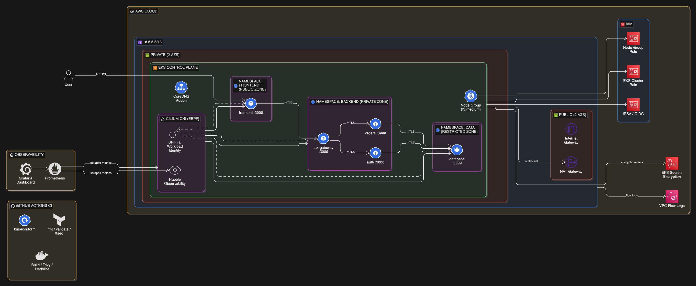
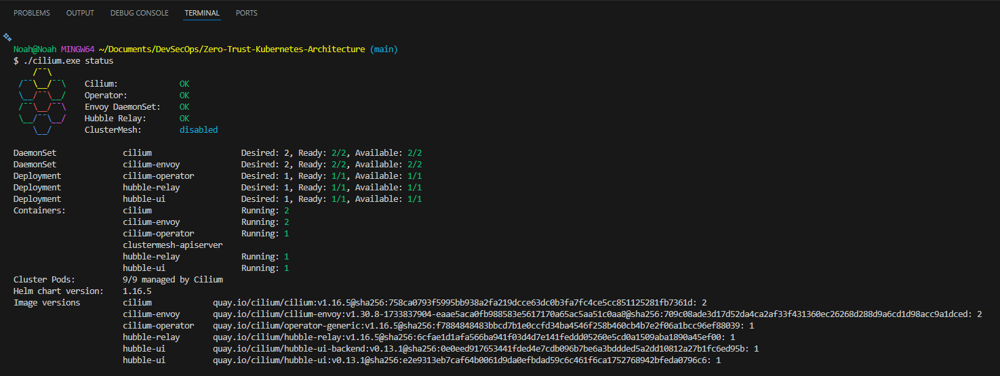
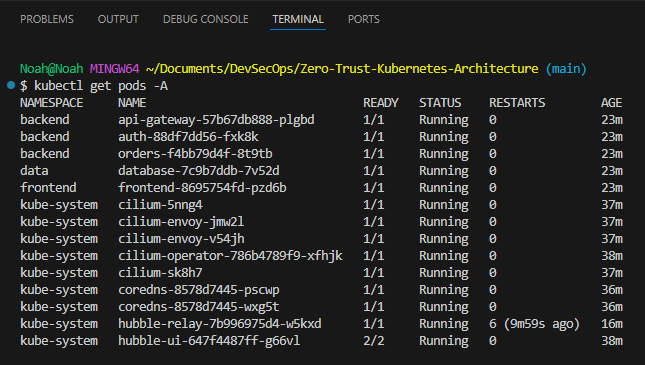
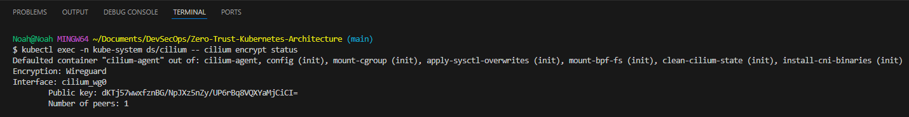
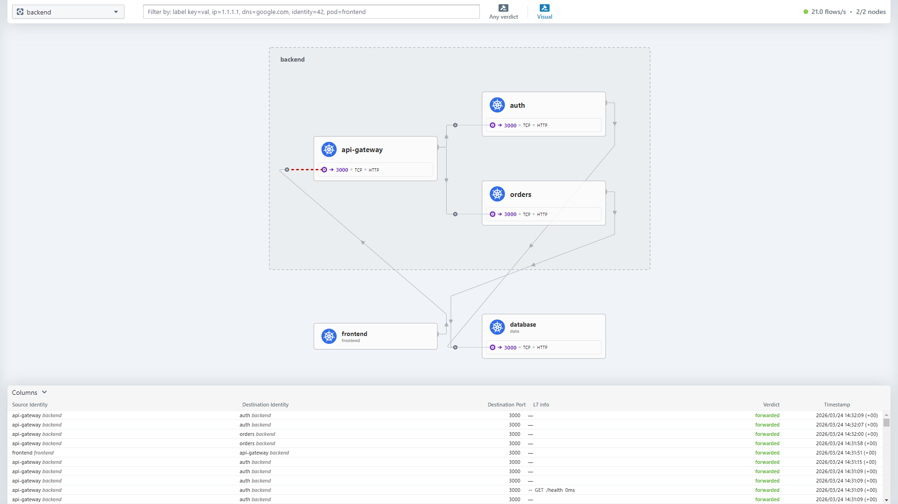
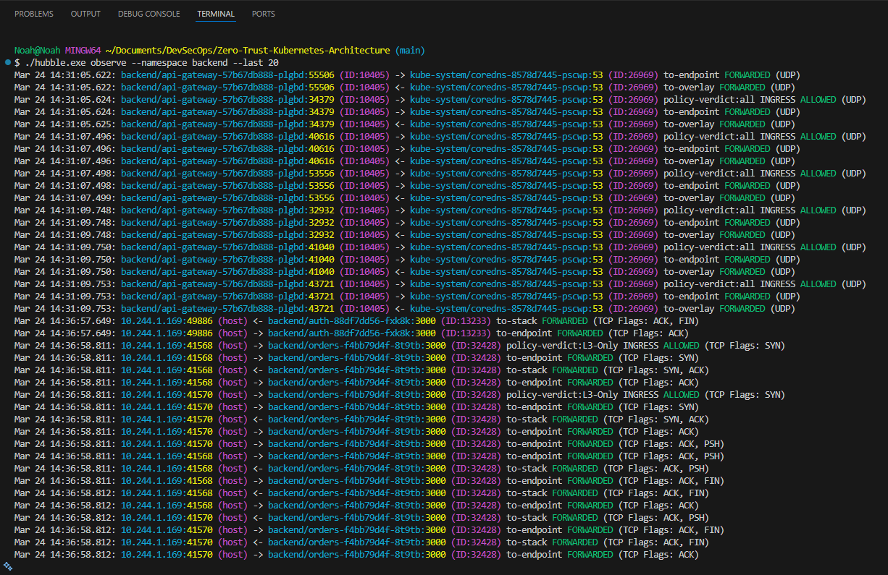
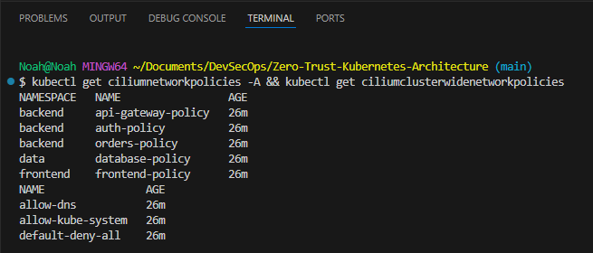
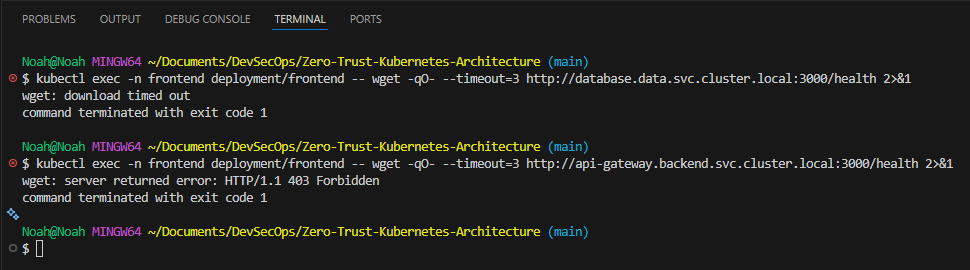
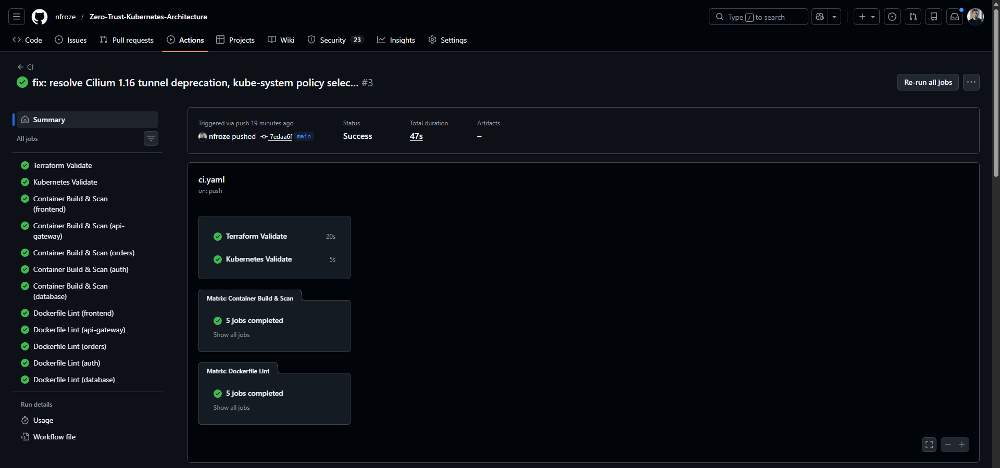

# Zero Trust Kubernetes Architecture

A production-grade zero trust implementation on AWS EKS using Cilium's eBPF dataplane for mTLS, L7 micro-segmentation, and workload identity — aligned with NIST SP 800-207.

## Overview

Most Kubernetes deployments rely on flat network trust: if a pod can reach another pod, it's allowed to talk. That model fails the moment an attacker gains a foothold inside the cluster. Zero trust flips this — every request is authenticated, authorised, and encrypted regardless of where it originates. This project implements that model on EKS using Cilium as the CNI, service mesh, and policy engine.

The architecture deploys a five-service microservices application across three security zones (public, private, restricted), each in its own Kubernetes namespace. Cilium enforces default-deny network policies at L3/L4 and L7, meaning services can only communicate on explicitly allowed HTTP methods and paths. Every connection is encrypted with mTLS using SPIFFE workload identities — no service trusts another based on network location alone. Hubble provides real-time flow visibility and policy verdict logging, delivering the "continuous verification" that zero trust demands.

Infrastructure is provisioned with Terraform across four modules (VPC, EKS, Cilium, Node Group) with a deliberate deployment ordering that solves the CNI chicken-and-egg problem on EKS. Secrets are encrypted at rest with KMS, nodes run exclusively in private subnets, containers run as non-root with read-only filesystems, and VPC Flow Logs provide a network audit trail. A four-stage CI pipeline validates Terraform, Kubernetes manifests, container images (Trivy vulnerability scanning), and Dockerfile best practices on every push.

## Architecture

Traffic flows from the frontend (public zone) through an API gateway to backend services (orders and auth), which query a database service in the restricted zone. Cilium sits at the kernel level via eBPF, enforcing policy on every packet without sidecar proxies. The L7 policies go beyond port-level controls — the auth service can only read user data from the database, while the orders service can read and write order data. Lateral movement between orders and auth is explicitly blocked, as is any direct frontend-to-database communication.

The EKS cluster disables the default AWS VPC CNI entirely, with Cilium taking over pod networking in overlay mode (VXLAN tunnelling). This gives Cilium full control of the datapath including ClusterIP service routing, which breaks in ENI mode when kube-proxy is replaced. The OIDC provider enables IAM Roles for Service Accounts, extending the workload identity model into AWS.

## Tech Stack

**Infrastructure**: AWS EKS, VPC (multi-AZ, public/private subnets), NAT Gateway, Terraform (modular, 4 modules)

**CNI / Service Mesh**: Cilium (eBPF dataplane), kube-proxy replacement, VXLAN overlay

**Identity & Encryption**: SPIFFE/SPIRE workload identity (mTLS), WireGuard node-to-node encryption, KMS (secrets at rest)

**Policy**: CiliumNetworkPolicy (L7 HTTP method/path enforcement), CiliumClusterwideNetworkPolicy (default-deny baseline)

**Observability**: Hubble (flow logs, service map, UI), Prometheus ServiceMonitors, Grafana (zero trust dashboard), VPC Flow Logs (CloudWatch)

**CI/CD**: GitHub Actions (4 jobs — Terraform validate/tfsec, kubeconform, Docker build/Trivy, Hadolint)

**Application**: Node.js microservices (5 services), hardened containers (non-root, read-only rootfs, capabilities dropped)

## Key Decisions

- **Cilium over Istio**: Cilium operates at the kernel level via eBPF, eliminating sidecar proxy overhead and the operational complexity of a separate control plane. It's a CNCF graduated project and the current-generation approach for Kubernetes networking and security. Istio adds latency per hop and requires managing an Envoy fleet — unnecessary when Cilium provides mTLS, L7 policy, and observability natively.

- **Overlay mode (VXLAN) over ENI mode**: AWS ENI mode assigns VPC IPs directly to pods, which bypasses the node's network stack. When kube-proxy is replaced by Cilium, ClusterIP service routing breaks because traffic never hits the node's eBPF programs. VXLAN overlay ensures Cilium controls the full datapath, making kube-proxy replacement and policy enforcement reliable.

- **L7 policies over L3/L4 only**: Standard Kubernetes NetworkPolicy stops at IP and port. Cilium's L7 policies enforce which HTTP methods and URL paths each service can use — the orders service can POST to `/api/data/orders` but the auth service can only GET `/api/data/users`. This is the difference between "these services can talk" and "these services can only say specific things to each other."

- **NIST SP 800-207 alignment**: The architecture maps directly to zero trust tenets — all communication is secured regardless of network location (mTLS), access is granted per-session on a per-resource basis (L7 policies), and the enterprise monitors and measures the security posture of all assets (Hubble + VPC Flow Logs). This framing demonstrates understanding of the framework enterprises actually use to evaluate zero trust maturity.

## Screenshots

**Cilium Status** — All components healthy: Cilium agents, Envoy proxies, Hubble Relay, and Hubble UI running across both nodes.

**Cluster Pods** — All workloads running across three namespaces (frontend, backend, data) alongside Cilium infrastructure in kube-system.

**WireGuard Encryption** — Node-to-node encryption active with WireGuard, confirming all inter-node traffic is encrypted at the network layer.

**Hubble Service Map** — Real-time service dependency visualisation showing traffic flows between all five services across namespaces.

**Hubble Flow Logs** — L7 flow visibility showing HTTP method, path, and policy verdicts for every request between services.

**Network Policies** — Per-service CiliumNetworkPolicies and cluster-wide default-deny baseline applied across all namespaces.

**Policy Enforcement** — Frontend-to-database request blocked (zero trust deny), frontend-to-API-gateway request allowed (explicit policy).

**CI Pipeline** — Four-stage pipeline: Terraform validation and tfsec scanning, Kubernetes manifest validation, container build with Trivy vulnerability scanning, and Dockerfile linting with Hadolint.

## Author

**Noah Frost**

- Website: [noahfrost.co.uk](https://noahfrost.co.uk)
- GitHub: [github.com/nfroze](https://github.com/nfroze)
- LinkedIn: [linkedin.com/in/nfroze](https://linkedin.com/in/nfroze)
